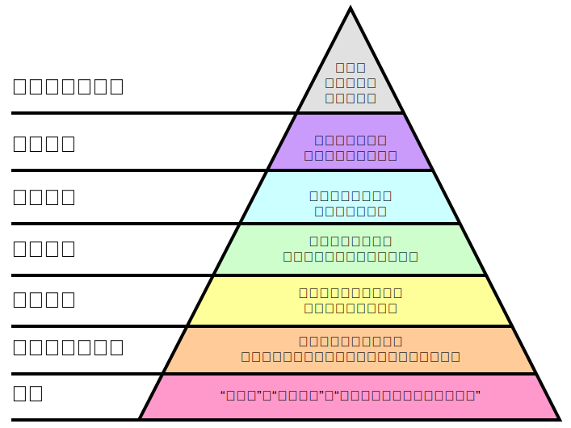

# 如何表达不同意见

原文：<http://www.paulgraham.com/disagree.html>

网络的出现把单纯的写作带进对话中。20年前，作者写作，读者阅读。网络使得读者能够回应，并且越来越多出现在评论区、论坛和他们自己的博客中。

许多人都评论表达不同的意见。这也在意料之中。持反对意见的评论比相同意见的更容易打动人们，而且当你同意的时候你通常没什么可以说的。你可以扩展作者所说的话，但是作者可能已经表述了最有意思的部分。而当你不同意的时候，你就已经进入了作者并没有阐述的部分。

因此结果就是，持反对意见的评论更多，起码的字数上是这样的。但这并不意味着人们变得愤怒。我们沟通结构上的变化足以证明一切。虽然没有愤怒，但是却进一步推进了分歧，有使人进一步愤怒的危险。特别在网上，人们不会面对面来讨论事情。

如果我们要进一步反对，那么我们就应该小心地适当反对。什么是适当反对？多数读者可以辨别出辱骂和仔细理性的驳斥，我尝试写了一个表达不同意见的层次结构：

## 第1级：辱骂

这是最低级的反对，但通常也是最常见的。我们都见过这样的评论：

> 傻逼吧
> 你个嘴炮
> 你妈知道你在这里说废话么？

但重要的是意识到越是平和的语言就越没有分量。比如：

> 作者是个狂妄自大的外行。

这样的评论还不如一句“傻逼”来得有效。

## 第2级：单纯的人身攻击

单纯的人身攻击要比辱骂更有效。比如说一个公务员写了一篇文章说公务员应该要涨工资，有人可能会评论：

> 他当然会这么说，因为他自己就是个公务员啊。

这并不会驳倒作者的观点，这起码的切题的，但这样的反对仍然非常弱。如果作者哪里说得不对，你可以直接说哪里不对；如果没有什么不对，那么和他是不是公务员又有什么关系呢？

说一个作者没有权利来写一个主题是另一种人身攻击，原因是好主意通常由外部人员想到。问题在于作者究竟是对是错。假如说是因为他没有权利而导致的错误，那么就指出他的错误；如果不是，那就没有问题。

## 第3级：批评语气

这一级别我们看到已经开始针对他的文字而不是作者本身了。最低级别的反对就是针对作者的语气了。比如：

> 我无法相信作者能这么漫不经心地评论时尚的智能化设计！

虽然比直接攻击作者要好多了，但这仍然是微弱的反驳。他们把反驳的重点放在作者的语气而不是在于作者是对是错。况且语气在文字上是比较难以判断的，有些人可能被一些主题的语气瑕疵所冒犯，那么对另一些人来说其实是中性的。

所以如果你对一件事最差的评价仅仅是它的语气，那还不如不要说了。你说作者漫不经心，那是否是说作者是正确的呢？那也比作者既果断又错误要好。假如他哪儿错了，直接指出就好了。

## 第4级：指出矛盾

在这一级别我们最终可以对“说了什么”进行回应，而不是“如何”或“谁”。反驳一个观点最弱的方式就是举一个反例，并仅有少量或没有证据。

第4级通常和第3级同时出现：

> 我无法相信作者能这么漫不经心地评论时尚的智能化设计！
> 智能设计是一项十分合理的科学理论。

指出矛盾有时能有些作用，比如能明确知道对立案例的正确性时。但如果有证据会更好。

## 第5级：使用论据

在这一级我们有了第一个有力的反驳形式：论据。之前的形式由于没能证明任何事情所以可以直接被忽略。而论据则可以证明一些事情。问题在于，无法精确表达。

“使用论据” = “指出矛盾” + 证据。当我们瞄准其原始论点的时候，这将是非常强有力的驳斥。但不幸的是通常论据会稍稍偏离关键点。再经常不过的一个例子：两个人在热烈争辩，但其实两个人在针对不同的事情。有时他们甚至相互认同，但却互相扰乱对方，这是他们可能都没有意识到。

## 第6级：原文反驳

最强有力的反驳就是“原文反驳（利用对手的发言指出自己的不同意之处）”。这种方式最有用，所以这种情况也最少。的确，驳斥结构恰好构建了一个金字塔，金字塔越高就越难找到实例。

在驳斥对手的时候你有可能需要引用对手的话。你需要找到一个“冒烟的枪”，一个你觉得错误的段落，然后解释为什么错误。如果你无法找到你不同意的原文引用，你实际上就是在和“稻草人”争论。

由于驳斥常常涉及引用，而引用不一定说到点上。一些人会引用部分来表达他们合理的驳斥，但却跟上和第4级（甚至第1级）一样的言语。

## 第7级：驳倒其中心论点

反驳是否有力还取决于你反驳什么。最有力的反驳就是直接反驳对手的中心论点。

像第6级这样，我们仍然可以深思熟虑来制造不实的信息（我们可以挑出作者的次要观点来反驳）。有时，这样做的意图可能是使人身攻击拥有诡辩的形式。比如，纠正某人的语法，或反复强调一些名称和数字上的小错误。除非作者真的依赖这些，你是无法直接驳倒他的。

真正驳斥一件事需要去驳斥它的中心论点，或至少是中心论点之一。这就意味着必须要明确表述观点。所以一个真正意义上有效的反驳应该是像这样的：

> 作者的主要观点好像是xxx，因为他说了：
> “xxxxx（引用）”
> 但是这其实是错的，因为：
> xxxxxxxx

你指出错误的引用无需是作者的主要观点，但这足以反驳他依赖该引用所表述的其他观点。

## 意义所在

现在我们已经能够分类反对方式了。有什么作用呢？驳斥分级并没有教会我们如果挑选胜者。驳斥分级仅仅描述了陈述的形式，而不是谁对谁错。第7级的回应可能仍然是错误的。

但是分级并没有设定说服力的上限与下限。第7级的回应可能也没有说服力，不过第3级以下（含）的回应一定是没有说服力的。

驳斥分级带来的最显而易见的优势就是帮助人们合理评价他们所阅读的东西。特别是能帮助他们理智地看穿不实的论点。一个好口才的演说者或作家可以使用强有力的话语来完胜对手。实际上这可以来定义一个政客的质量。通过对不同反驳的命名，我们可以给差劲的读者当头一棒。

这些标签也能帮助作者。多数理智的谎言并不是蓄意的。一些反驳作者语气的人可能真的觉得作者真的不对，因此了解了驳斥分级可以激励他往更高层次的反驳而去。

但是反驳最大的好处并不仅仅是使对话更好，而是使得真的有反对意见的人们更加愉快。如果你研究过对话，你会发现有一些评论在第1级以下，或是在第6级以上。因此，如果你有什么确切的要说，要找准方向。

如果说在驳斥分级的金字塔向上移动会使人们文雅些，那么这会让大多数人将会更愉快。大多数人并不真的喜欢变得粗鲁，他们之所以这么做是因为他们不知道如何表达。

2008年3月

Paul Graham

2015年7月 译
