# 基于Kubernetes容器基础设施在哈啰出行的应用

## 摘要

介绍目前应用发布部署运维的痛点，如何利用 Kubernetes 在哈啰出行解决这些问题、如何实践、以及业务的收益、未来的规划。

日期：2019-06-03  
听众：业务同学

## 发现问题：应用发布、部署、运维中的痛点

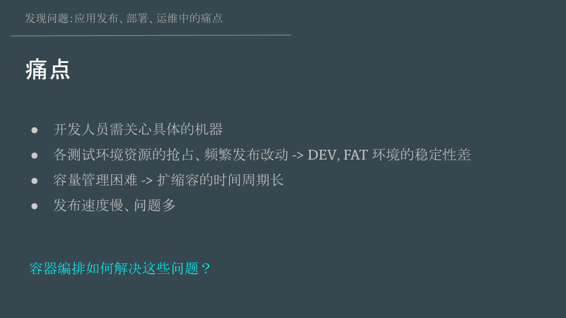

目前来说，公司的开发、测试、部署模式由于全都跑在云主机上会存在一些问题，开发人员需要关心自己的应用具体跑在什么机器上，这一层应该对开发人员屏蔽，他们只需要知道我的应用正在正常跑着呢！就OK了。

所有的开发人员都可以在 DEV 环境提交发布，这就会导致环境资源的抢占、频繁的发布改动，最终导致 DEV/FAT 环境实质上是不可用的。

对于应用的扩缩容，没有一个完善的机制，需要应用的业务方在 CMDB 中手动申请机器资源，等待 10-20 分钟的初始化时间后，再提交重新发布，整个周期会非常长，无法应对业务量的突然增长；因此则会导致业务方直接按最大的预估量来申请机器，导致资源的浪费。

目前发布系统问题比较多，Jenkins 机器的性能不够，一些设计在量少的情况下没有问题，但是量大了则会在无法预估的地方出现问题。编译、发布并不是分布式架构，会导致集中发布的时候会等待非常长的时间。

那么容器编排是如何解决这些问题的呢？

## 解决思路：使用 Kubernetes 解决这些问题的实现细节

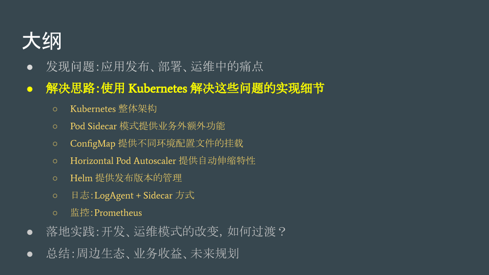

这里我从业务的角度在以下几个方面来给大家介绍一下 Kubernetes 能如何解决这些问题：

- Kubernetes 整体架构
- Pod Sidecar 模式提供业务外额外功能
- ConfigMap 提供不同环境配置文件的挂载
- Horizontal Pod Autoscaler 提供自动伸缩特性
- Helm 提供发布版本的管理
- 日志：LogAgent + Sidecar 方式
- 监控：Prometheus

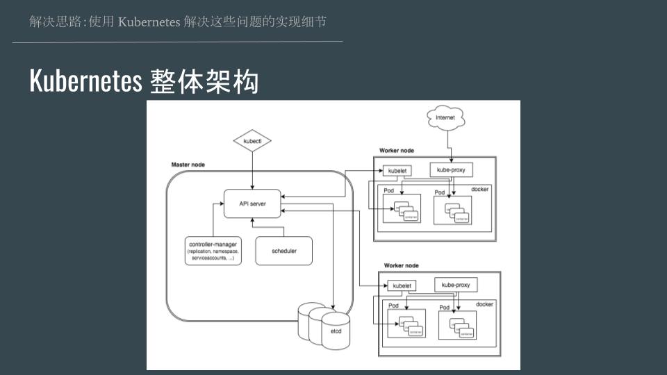

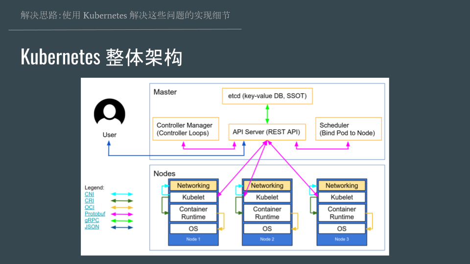

*注：Kubernetes 的整体架构我这里不赘述了，大把的资料*

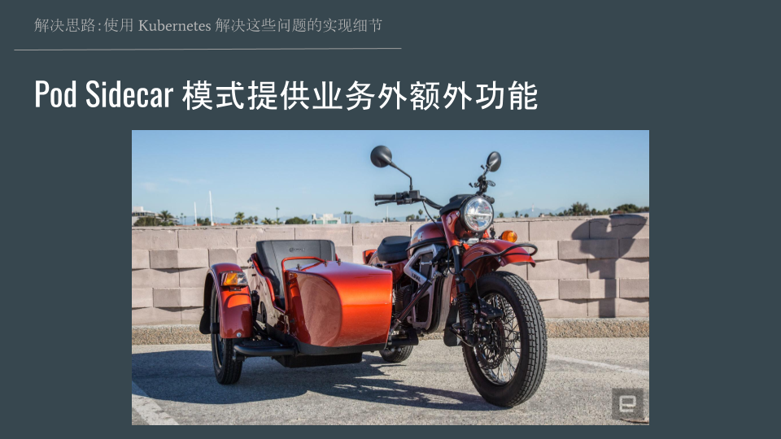

这里介绍一下 Sidecar 模式：

所谓 Sidecar 就是大家小时候看到的这货的旁边的这个座位，也就是边车。我们知道 Kubernetes 自己凭空造了一个 「Pod」 的概念，大家知道为什么要有这个 Pod 的概念吗？

Docker 的设计理念就是进程级别的，可是如果我想在同一个容器中跑两个有交互的应用怎么办？几年前，会有这种做法，在容器中起一个类似 init 的进程（如：supervisord 或 dumb-init），然后在这里面开各种应用，比如 sshd 比如调试工具什么的。这就有个问题了，多个应用的镜像怎么打？如果一个应用有更新，就连带所有相关的镜像都需要重新构建，这是这种方式的一个坑。因此 Kubernetes 回归 Docker 原生的理念，每个容器只做一件事，Pod 把这些容器连接起来，共享网络、Pid 空间、namespace 等等。

因此所谓的 「Sidecar」 就是 Pod 中非业务的其他负责如日志收集、Istio 中的 Proxy 容器

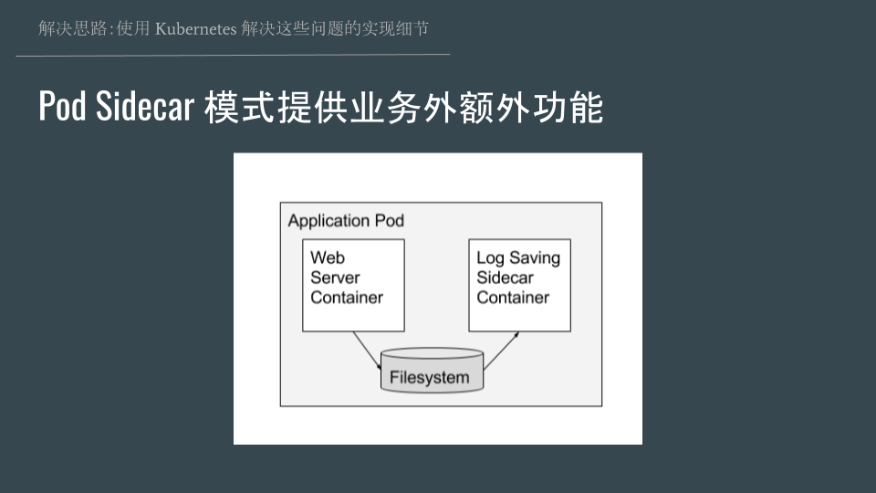

举个例子，我们的业务收集的平滑过渡就是用的 Sidecar 模式，Pod 中有业务应用和日志收集器，这两个容器共享日志目录，来做到业务日志的收集。

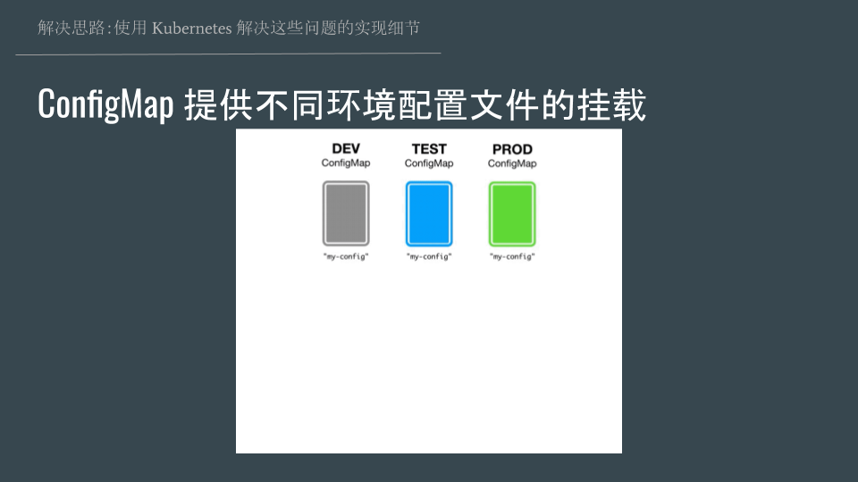

接下来我们谈另一个问题，配置文件的管理。

哈啰出行内部有很多套环境，分别做不同的用途，因此他们连接的数据库、redis 以及其他的业务参数都有些不同，我们有现成的配置管理中心解决方案，但是 Kubernetes 中如何做的呢？我们首选当然是利用原生的 「ConfigMaps」。在做 CD 的时候，将配置中心的配置拉下来导入 ConfigMaps 即可。

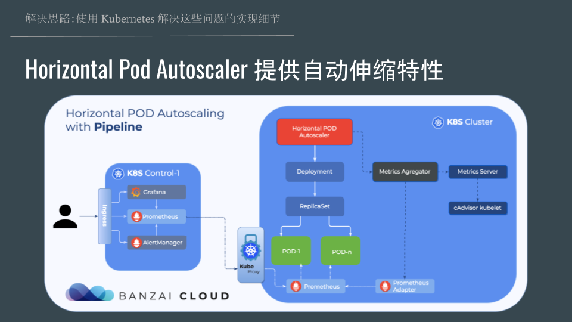

关于横向动态扩缩容，这使用 Kubernetes 的一个亮点，这里简单说一下原理：

通过 Pod 的性能指标的获取与阈值做比较，来决定当前是扩容还是缩容。性能指标可以由 Kubernetes 内置的 heapster 或 metrics-server 来获取或通过插件由 Prometheus 来提供。

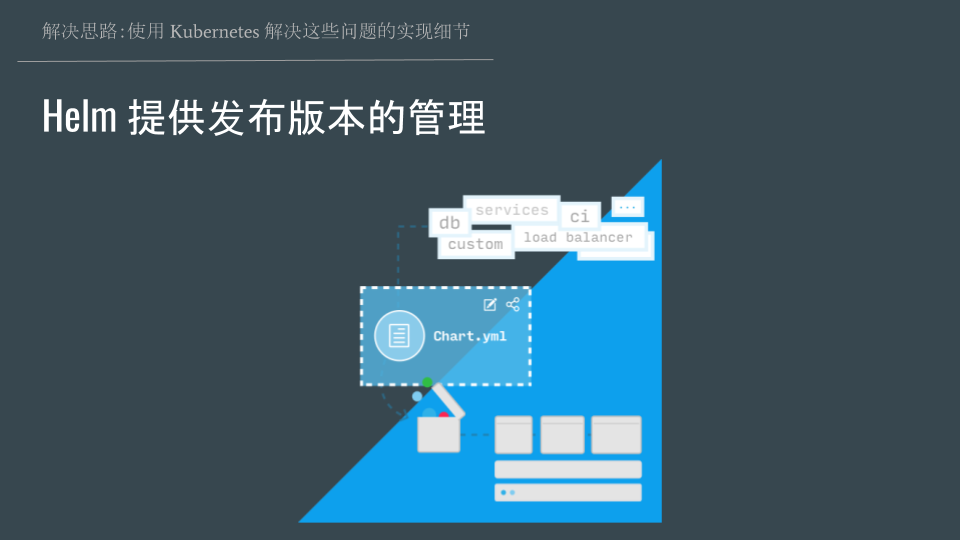

关于应用版本的管理，我们这里使用了 「Helm」，它是 Kubernetes 层面的包管理工具，相当于 yum 或 apt-get。

Kubernetes 的设计原理之一 或者说与 Mesos 等竞品的最大差别就在于，Kubernetes 只维护的一个状态，然后集群根据自身状况，不断逼近这个状态。

Kubernetes 维护状态的方法就是使用资源 Api，对于我们用户来说就是一堆 yaml 文件。如何维护这些 yaml 文件也就成了新的问题，早前的话一般是自建一套模板引擎，或者使用 GitOps 的方式，把所有的 yaml 文件都放置在一个 git 仓库中进行管理。但这两种方式都对状态的统一性和回退的方便程度有很大的局限。

因此 Helm 是个很好的工具。

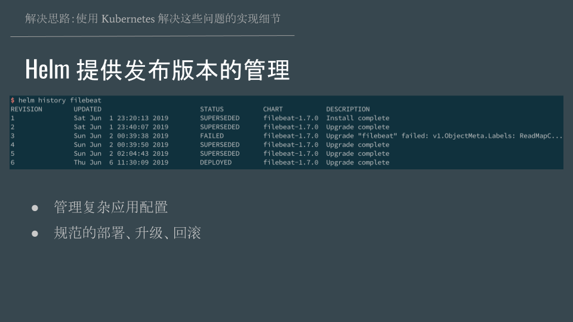

不仅把资源文件打包成一个文件，并且额外提供版本管理的功能。方便用户进行回退版本。

*（演示一下）*

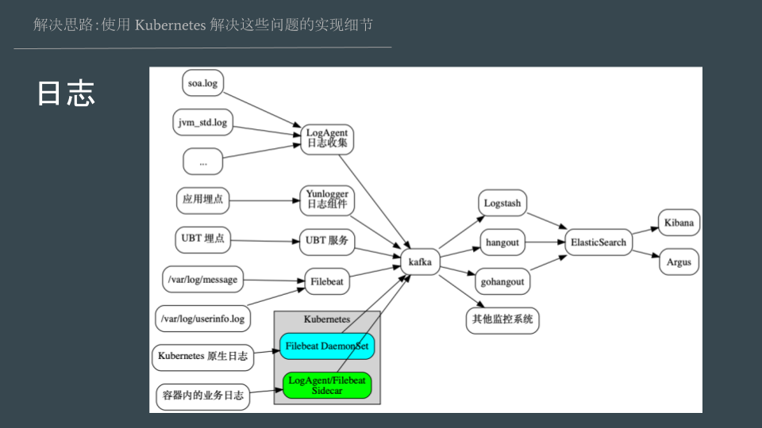

日志是各位业务同学比较关心的问题了。

关于 Kubernetes 的日志方案的选择，我们首先要知道究竟需要管理哪些日志。

- 宿主机节点的系统日志，如 `/var/log/*`
- Kubernetes 的容器 stdout 日志
- 容器内部的业务日志

具体方案：

- 系统日志：我们在 Kubernetes 上部署一个 Filebeat 的 DaemonSets 然后把 /var/log 挂载到这个容器中。
- 容器的 stdout 日志：同样利用 Filebeat 的 DaemonSets 使用他的 Kubernetes 模块即可收集到这些日志。
- 业务日志：目前的业务日志都会打在一个目录，然后通过自研的日志收集器打到不同的地方。当前我们会沿用这个方式，在 Pod 中添加一个日志收集器的 Sidecar。

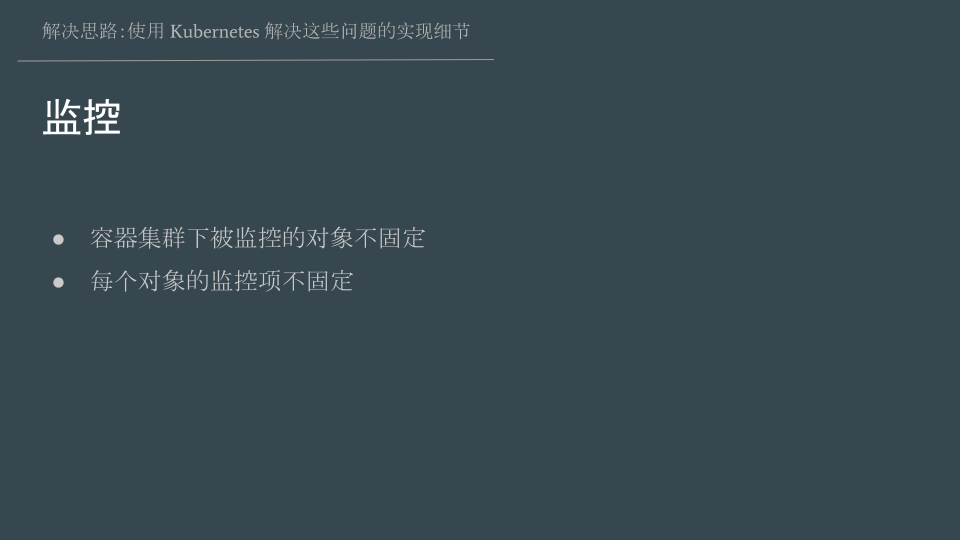

接下来说一下监控的方案，提到 Kubernetes 下的监控一般大家都能想到 Prometheus，那到底为什么要用 Prometheus 很多人可能还不清楚。与传统的监控相比我觉得容器的监控有以下两个最大的区别：

1. 容器集群下的被监控对象不固定
2. 每个对象的监控项是不固定的。

传统的 zabbix 监控下，机器是相对比较固定的，申请了一台机器，同时把这台机器加到 zabbix 中即可。而 Kubernetes 的话，Pod 的每时每秒都会在改变的。

zabbix 的监控项，我们通常的做法是在所有的机器中都添加一些统一的脚本，然后通过 zabbix-server 来决定需要在什么时候执行什么样的脚本。而目前业界认为，更好的做法是应用本身提供监控接口，毕竟谁都不会比应用本身更了解自己。

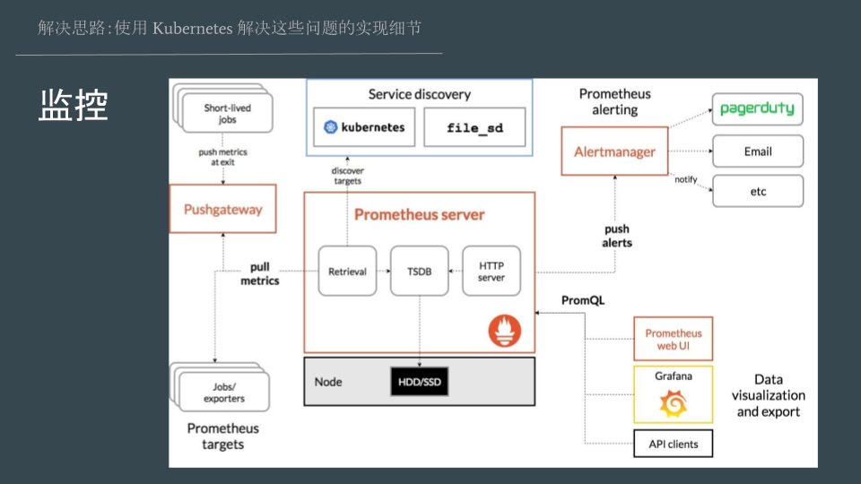

*简单说清楚 Prometheus 的这张官方架构图*

## 落地实践：开发、运维模式的改变，如何过渡？

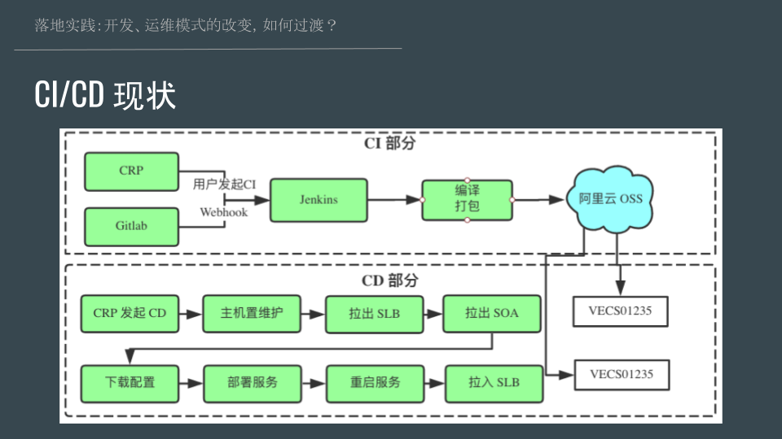

这里简述一下目前公司的 CI/CD 现状：……

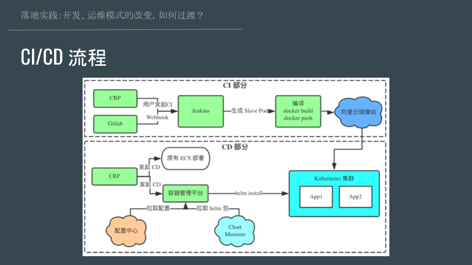

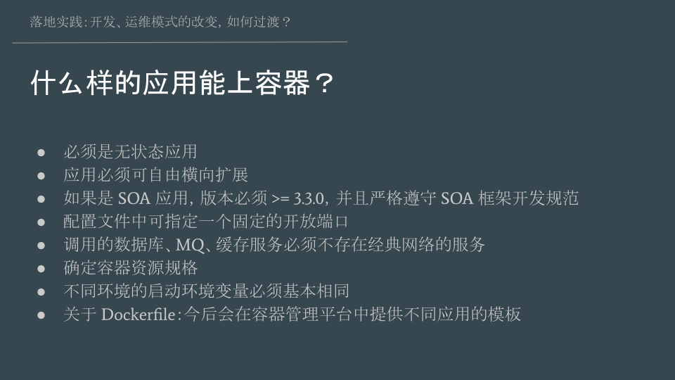

## 总结：周边生态、业务收益、未来规划

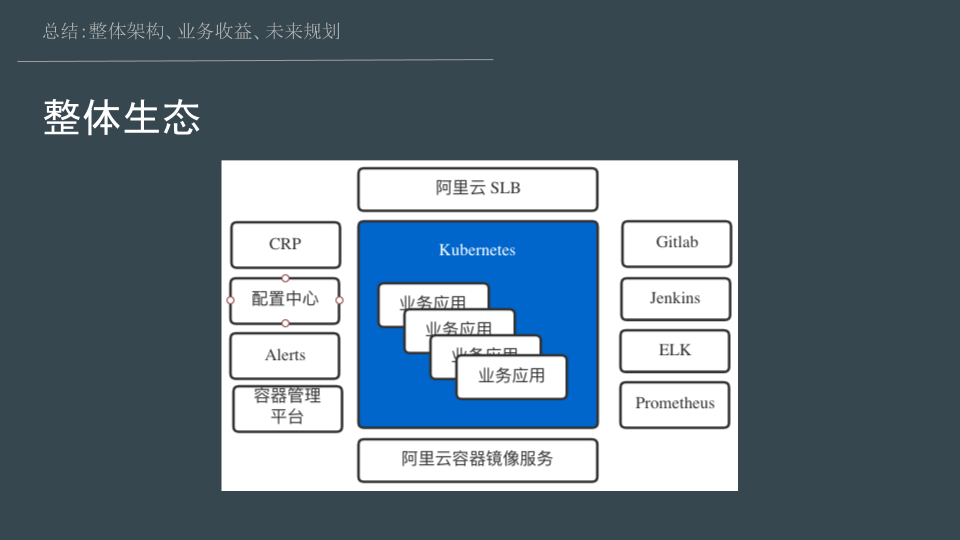

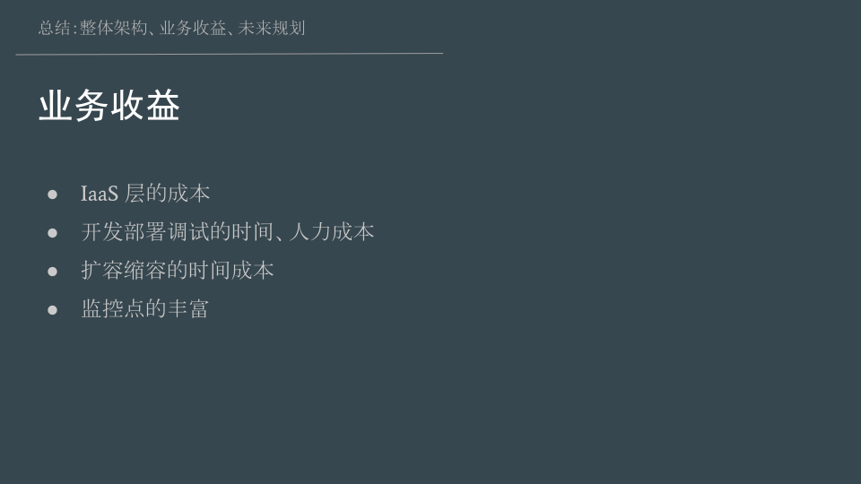

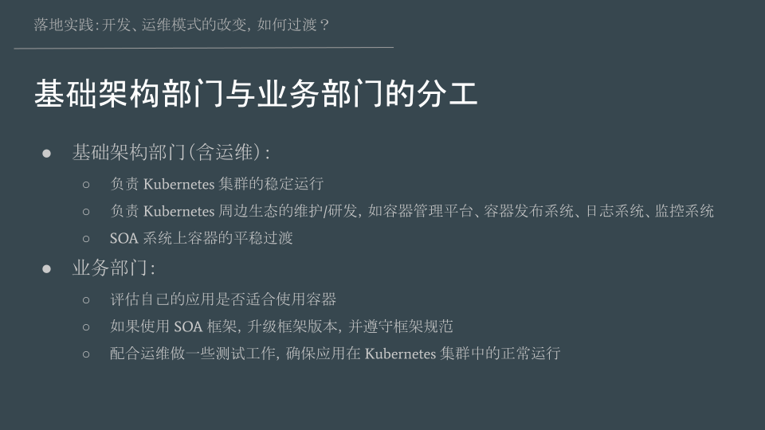

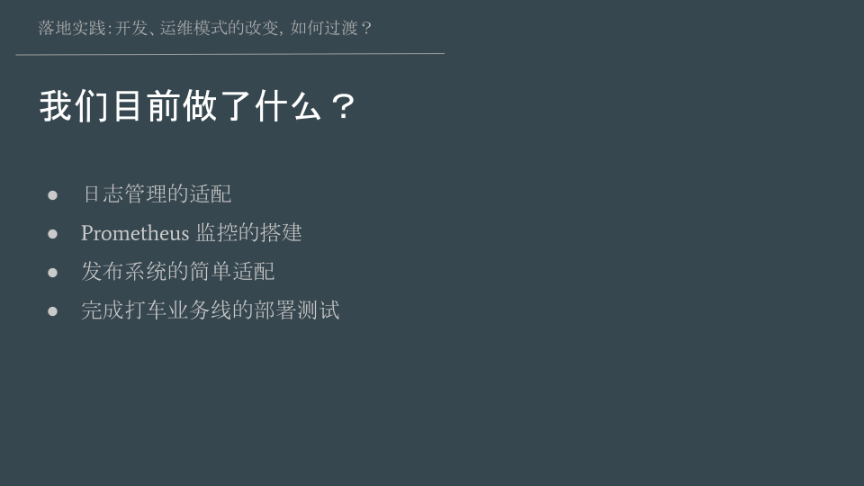

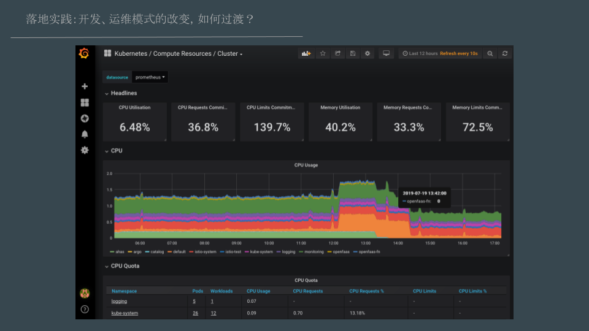

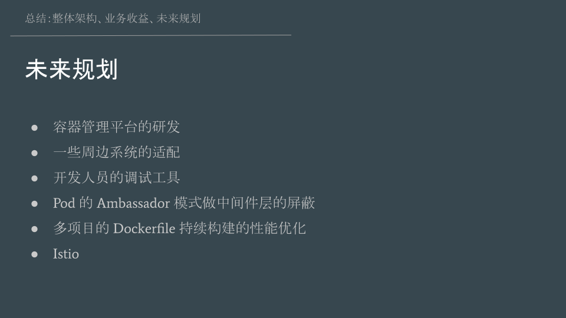
