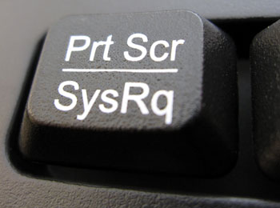

# 魔术键 SysRq



## 使用场景

文件/数据库服务器，能ping通，但无法ssh登录，也不能通过本地终端登录，只能重启。但是硬重启可能会出现硬盘数据不一致、文件系统损坏的情况。这时可以通过SysRq键来进行紧急操作。

系统虽然罢工，但是对大部分服务依然相应，仍然能处理键盘的中断请求。

## 系统是否支持？

```bash
# grep "CONFIG_MAGIC_SYSRQ" /boot/config-`uname -r`
CONFIG_MAGIC_SYSRQ=y

# sysctl kernel.sysrq
sysctl kernel.sysrq = 1
```

## 推荐按键组合

`Alt + SysRq + R-E-I-S-U-B`，或也可以想成是`BUSIER`倒过来拼写

```
unRaw      - 把键盘设置为 ASCII 模式
 tErminate - 向除 init 外所有进程发送 SIGTERM 信号
 kIll      - 向除 init 外所有进程发送 SIGKILL 信号
  Sync     - 磁盘缓冲区同步
  Unmount  - 重新挂载为只读模式
reBoot     - 重启系统 
```

**推荐的时间间隔**

R - 1s - E - 30s - I - 10s - S - 5s - B

## 其他用法

|Action|QWERTY|
|:------------|:-:|
|Set the console log level, which controls the types of kernel messages that are output to the console|0 through 9|
|Immediately reboot the system, without unmounting or syncing filesystems|b|
|Perform a system crash. A crashdump will be taken if it is configure|c|
|Display all currently held Locks (CONFIG_LOCKDEP kernel option is required) |d|
|Send the SIGTERM signal to all processes except init (PID 1)|e|
|Call oom_kill, which kills a process to alleviate an OOM conditi|f|
|When using Kernel Mode Setting, provides emergency support for switching back to the kernel's framebuffer console[4] If the in-kernel debugger 'kdb' is present, enter the debugger.|g|
|Output a terse help docume|o|
|Any key which is not bound to a command should also perform this action |h|
|Send the SIGKILL signal to all processes except init|i|
|Forcibly "Just thaw it" – filesystems frozen by the FIFREEZE ioctl. |j|
|Kill all processes on the current virtual console (can kill X and svgalib pro|s|
|This was originally designed to imitate a secure attention k|k|
|Shows a stack backtrace for all active CPUs.|l|
|Output current memory information to the console|m|
|Reset the nice level of all high-priority and real-time task|n|
|Shut off the system |o|
|Output the current registers and flags to the consol|p|
|Display all active high-resolution timers and clock sources.|q|
|Switch the keyboard from raw mode, the mode used by programs such as X11 and svgalib, to XLATE mode |r|
|Sync all mounted filesystems|s|
|Output a list of current tasks and their information to the console |t|
|Remount all mounted filesystems in read-only mod|u|
|Forcefully restores framebuffer console, except for ARM processors, where this key causes ETM buffer dum|v|
|Display list of blocked (D state) tasks |w|
|Used by xmon interface on PPC/PowerPC platforms.|x|
|Show global CPU registers (SPARC-64 specific|y|
|Dump the ftrace buff|z|
|Print a summary of available magic SysRq keys|space|

## kernel.sysrq 的值说明

```
   0 - disable sysrq completely
   1 - enable all functions of sysrq
  >1 - bitmask of allowed sysrq functions (see below for detailed function
       description):
          2 =   0x2 - enable control of console logging level
          4 =   0x4 - enable control of keyboard (SAK, unraw)
          8 =   0x8 - enable debugging dumps of processes etc.
         16 =  0x10 - enable sync command
         32 =  0x20 - enable remount read-only
         64 =  0x40 - enable signalling of processes (term, kill, oom-kill)
        128 =  0x80 - allow reboot/poweroff
        256 = 0x100 - allow nicing of all RT tasks
```

## 参考文档

1. <https://en.wikipedia.org/wiki/Magic_SysRq_key>
2. <https://www.kernel.org/doc/Documentation/sysrq.txt>
